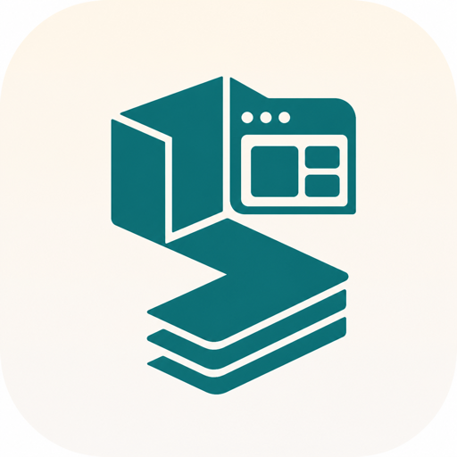

# Skill My App

<p align="center">
  
</p>

<p align="center">
  <strong>Décris le produit. L’agent le construit — propre, testé, documenté, et pas cher en tokens.</strong>
</p>

<p align="center">
  Skills Claude Code &amp; Cursor pour scaffolder et faire évoluer des apps<br/>
  <strong>TypeScript · Next.js · NestJS (seulement si vraiment nécessaire)</strong>
</p>

<p align="center">
  <a href="#installation">Installation</a> ·
  <a href="#utilisation">Utilisation</a> ·
  <a href="#ce-que-tu-obtiens">Ce que tu obtiens</a> ·
  <a href="#pourquoi-cest-différent">Pourquoi c’est différent</a>
</p>

---

## Le problème

Tu lances un agent sur « fais-moi mon site ». Tu récupères :

- du code qui compile… parfois  
- zéro architecture stable  
- des docs inventées ou absentes  
- une session suivante qui **re-dérive tout** et brûle ton budget tokens  

**Skill My App** inverse ça : le premier run pose les fondations ; tous les suivants ne relisent que ce qu’il faut.

## La promesse

| Au bootstrap (`skill-my-app`) | Ensuite (`ask-my-app`) |
|---|---|
| Questions ciblées (pas un interrogatoire) | Lit `INDEX.md` + 1–2 fichiers utiles |
| Choix techniques dérivés du **prompt** | Pas de rediscovery, pas de re-archi |
| Docs `documentation/` **commitées** | État dans le repo, pas dans le chat |
| Scaffold déterministe (kit prêt à copier) | Gate typecheck / lint / tests / e2e |
| Strict TS, clean archi, sécu App Router | Même contrat, facture tokens minimale |

Une phrase : **docs-first, tooling-enforced, continuation cheap.**

## Ce que tu obtiens

- **App Next.js** (App Router) avec couches `domain` → `application` → `infrastructure` → présentation  
- **NestJS en monorepo** uniquement quand le produit le justifie (API multi-clients, workers, etc.)  
- **Règles compilées** dans tsconfig, eslint, headers CSP, Vitest, Playwright + a11y (axe)  
- **Knowledge base vivante** : architecture, domaine, décisions, changelog — rotatée pour rester courte  
- **Décisions tech automatiques** : tables signal → stack (`tech-choices.md`) — tu ne choisis pas Drizzle vs Nest « au feeling »  
- Compatible **Claude Code** et **Cursor**

## Comment ça marche

```text
  Ton prompt produit
         │
         ▼
 ┌───────────────────┐
 │   skill-my-app    │  bootstrap une seule fois
 │  discovery → docs │
 │  → scaffold → v1  │
 └─────────┬─────────┘
           │  documentation/INDEX.md  (commité)
           ▼
 ┌───────────────────┐
 │    ask-my-app     │  chaque feature / fix ensuite
 │  INDEX + 1–2 files│
 └───────────────────┘
```

Deux skills, un contrat. Le cher est amorti une fois ; le fréquent reste léger.

## Utilisation

**1. Bootstrap** — nouveau projet :

```text
/skill-my-app Un outil perso de todos, sans compte, UI minimaliste, persistance locale
```

**2. Suite** — même repo, plus tard :

```text
/ask-my-app Ajoute un filtre « done / active » et l’e2e associé
```

Compacte le contexte entre deux sujets sans rapport (`/compact` sur Claude, ou nouveau chat sur Cursor) : **tout ce qu’il faut pour reprendre est déjà dans `documentation/`**.

## Installation

### Dans ce repo

- Claude Code : `.claude/skills/*`  
- Cursor : `.cursor/skills/*` (symlinks → source unique)

### Global (tous tes projets)

```sh
git clone https://github.com/XyDisorder/skill-my-app.git
cd skill-my-app

mkdir -p ~/.claude/skills ~/.cursor/skills

ln -s "$(pwd)/.claude/skills/skill-my-app" ~/.claude/skills/skill-my-app
ln -s "$(pwd)/.claude/skills/ask-my-app"   ~/.claude/skills/ask-my-app

ln -s "$(pwd)/.claude/skills/skill-my-app" ~/.cursor/skills/skill-my-app
ln -s "$(pwd)/.claude/skills/ask-my-app"   ~/.cursor/skills/ask-my-app
```

Garde les deux skills **côte à côte** : `ask-my-app` résout `../skill-my-app/references/` si besoin.

## Pourquoi c’est différent

| Approche classique agent | Skill My App |
|---|---|
| Tout dans le transcript | État versionné dans `documentation/` |
| Un mega-prompt fourre-tout | Bootstrap cher ≠ continuation cheap |
| « No `any` » en prose oubliable | Encodé dans tsconfig / eslint / CI |
| Config reinventée à chaque fois | Kit `templates/scaffold/` à copier |
| Nest « au cas où » | Nest seulement si le prompt le justifie |
| Docs gitignorées → clone amnésique | Docs **commitées** ; `ask-my-app` survit au clone |

## Anti-triggers (ne l’utilise pas pour)

- Un tweak CSS / une typo isolée  
- Un repo qui n’est pas TypeScript  
- Un projet qui a **déjà** `documentation/knowledge-base/` → utilise **`ask-my-app`**, pas le bootstrap  

## Pour les mainteneurs

```sh
./scripts/smoke-check.sh
```

Version : `.claude/skills/skill-my-app/VERSION` · changelog : [`CHANGELOG.md`](CHANGELOG.md) · principes : [`skill-principles.md`](.claude/skills/skill-my-app/references/skill-principles.md) · choix tech : [`tech-choices.md`](.claude/skills/skill-my-app/references/tech-choices.md)

---

<p align="center">
  <sub>Fais le produit. Pas le prompt engineering.</sub>
</p>
