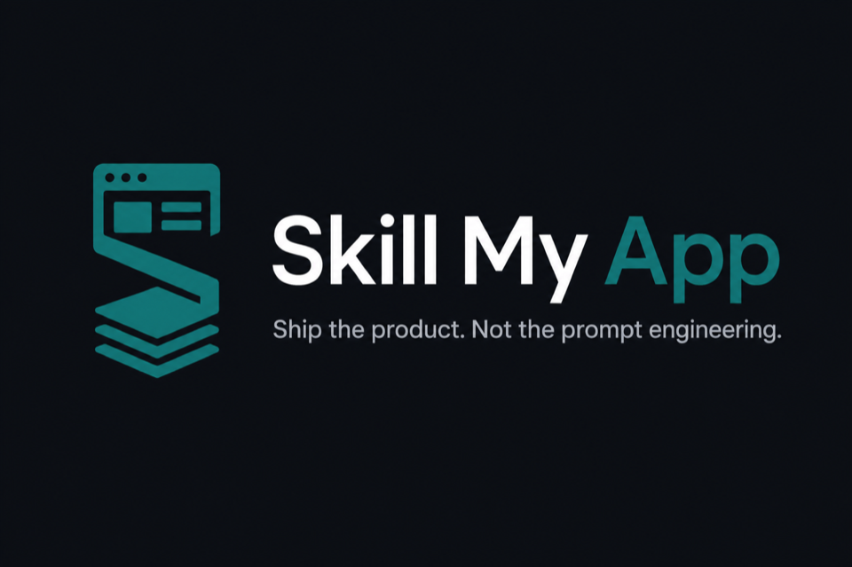

# Skill My App

<p align="center">
  
</p>

<p align="center">
  <strong>Describe the product. The agent builds it — clean, tested, documented, and cheap on tokens.</strong>
</p>

<p align="center">
  Claude Code &amp; Cursor skills to scaffold and grow<br/>
  <strong>TypeScript · Next.js · NestJS (only when you actually need it)</strong>
</p>

<p align="center">
  <a href="#installation">Install</a> ·
  <a href="#usage">Usage</a> ·
  <a href="#what-you-get">What you get</a> ·
  <a href="#why-its-different">Why it’s different</a>
</p>

---

## The problem

You ask an agent to “build my site.” You get:

- code that *sometimes* compiles  
- no stable architecture  
- missing or invented docs  
- the next session **re-deriving everything** and burning your token budget  

**Skill My App** flips that: the first run lays the foundation; every later run only reads what it needs.

## The promise

| At bootstrap (`skill-my-app`) | Afterward (`ask-my-app`) |
|---|---|
| Targeted questions (not an interrogation) | Reads `INDEX.md` + 1–2 relevant files |
| Tech choices derived from the **prompt** | No rediscovery, no re-architecture |
| Committed `documentation/` | State lives in the repo, not the chat |
| Deterministic scaffold (copy-ready kit) | Typecheck / lint / test / e2e gate |
| Strict TS, clean architecture, App Router security | Same contract, minimal token bill |

One line: **docs-first, tooling-enforced, continuation cheap.**

## What you get

- A **Next.js** app (App Router) with `domain` → `application` → `infrastructure` → presentation layers  
- **NestJS in a monorepo** only when the product justifies it (multi-client API, workers, etc.)  
- **Rules compiled** into tsconfig, eslint, CSP headers, Vitest, Playwright + a11y (axe)  
- A **living knowledge base**: architecture, domain, decisions, changelog — rotated so it stays short  
- **Automatic tech decisions**: signal → stack tables (`tech-choices.md`) — you don’t pick Drizzle vs Nest “by vibe”  
- Works with **Claude Code** and **Cursor**

## How it works

```text
  Your product prompt
         │
         ▼
 ┌───────────────────┐
 │   skill-my-app    │  bootstrap once
 │  discovery → docs │
 │  → scaffold → v1  │
 └─────────┬─────────┘
           │  documentation/INDEX.md  (committed)
           ▼
 ┌───────────────────┐
 │    ask-my-app     │  every later feature / fix
 │  INDEX + 1–2 files│
 └───────────────────┘
```

Two skills, one contract. Pay the expensive thinking once; keep day-to-day work light.

## Usage

**1. Bootstrap** — new project:

```text
/skill-my-app A personal todo tool, no accounts, minimal UI, local persistence
```

**2. Continue** — same repo, later:

```text
/ask-my-app Add a done/active filter and the matching e2e
```

Compact context between unrelated tasks (`/compact` on Claude, or a fresh chat on Cursor): **everything needed to resume already lives in `documentation/`**.

## Installation

### In this repo

- Claude Code: `.claude/skills/*`  
- Cursor: `.cursor/skills/*` (symlinks → single source of truth)

### Global (any project)

```sh
git clone https://github.com/XyDisorder/skill-my-app.git
cd skill-my-app

mkdir -p ~/.claude/skills ~/.cursor/skills

ln -s "$(pwd)/.claude/skills/skill-my-app" ~/.claude/skills/skill-my-app
ln -s "$(pwd)/.claude/skills/ask-my-app"   ~/.claude/skills/ask-my-app

ln -s "$(pwd)/.claude/skills/skill-my-app" ~/.cursor/skills/skill-my-app
ln -s "$(pwd)/.claude/skills/ask-my-app"   ~/.cursor/skills/ask-my-app
```

Keep both skills as **siblings** so `ask-my-app` can resolve `../skill-my-app/references/` when needed.

## Why it’s different

| Typical agent approach | Skill My App |
|---|---|
| Everything in the transcript | Versioned state in `documentation/` |
| One mega catch-all prompt | Expensive bootstrap ≠ cheap continuation |
| “No `any`” as forgettable prose | Encoded in tsconfig / eslint / CI |
| Config reinvented every time | Copy `templates/scaffold/` |
| Nest “just in case” | Nest only when the prompt justifies it |
| Gitignored docs → amnesiac clones | **Committed** docs; `ask-my-app` survives clone |

## Anti-triggers (don’t use it for)

- A one-off CSS / copy tweak  
- A non-TypeScript repo  
- A project that **already** has `documentation/knowledge-base/` → use **`ask-my-app`**, not bootstrap  

## Maintainers

```sh
./scripts/smoke-check.sh
```

Version: `.claude/skills/skill-my-app/VERSION` · changelog: [`CHANGELOG.md`](CHANGELOG.md) · principles: [`skill-principles.md`](.claude/skills/skill-my-app/references/skill-principles.md) · tech choices: [`tech-choices.md`](.claude/skills/skill-my-app/references/tech-choices.md)
